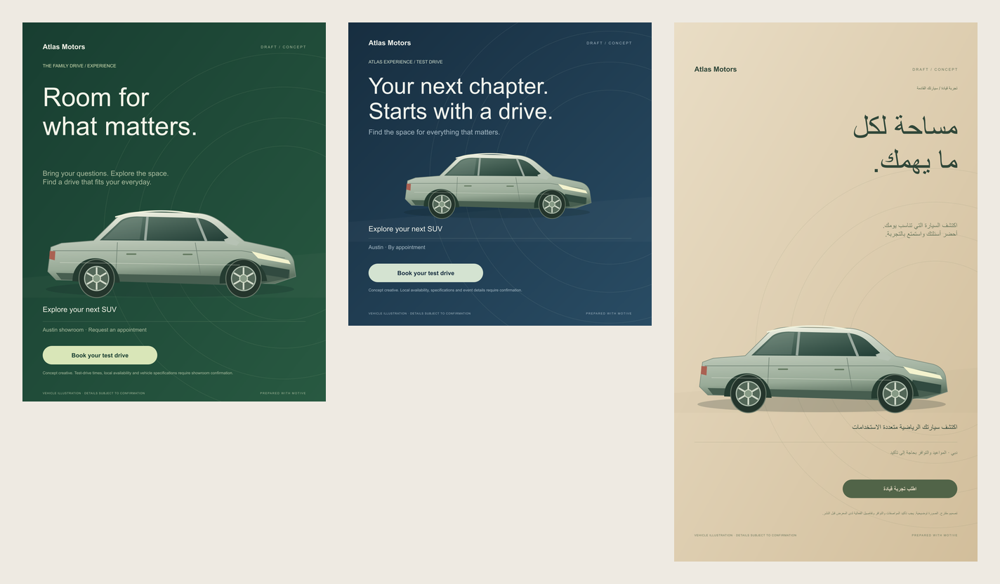

# Motive · 海外汽车营销 Cowork

让客户的故事，成为团队有准备的下一步。

Motive 面向海外汽车经销商的销售、市场、客户运营与售后岗位。中文工作台，英语、阿拉伯语、德语客户内容；将客户画像、记忆、车源、任务和交付物放在同一工作空间。



## 1.1 版本

- **文案与海报一起交付**：活动包生成后保存两个关联交付物，也可直接从“设计海报”开始。
- **可编辑海报**：品牌、标题、车型标签、时间地点、行动按钮、说明文字；森林绿、沙漠金、午夜蓝三种配色。
- **三种实际导出尺寸**：1080×1080、1080×1350、1080×1920，支持 SVG 和 PNG，长文字自动缩放、折行，支持阿拉伯语 RTL。
- **审核流程**：未审核图片带草稿标记，修改已审核海报后重新进入审核。
- **Copilot SDK 服务端适配**：独立任务会话、必要客户上下文、同市场车源、上一版内容修改、明确失败和重试。
- **部署配置**：工作区密码、服务端凭据、来源校验、并发限制、Docker Compose、可选 HTTPS 与发布包脚本。

当前源码已通过本地测试；真实 Copilot 依赖安装、模型调用和 Azure 部署仍待完成。海报由原生矢量设计生成，Copilot 负责视觉文案；目前未接入文生图模型或真实车型照片库。

## 本地运行

要求 Node.js 22+。默认使用真实 Copilot；先安装服务端依赖与 Copilot CLI，并为服务运行账户完成登录：

```sh
npm install
npm install -g @github/copilot
copilot
```

按 CLI 提示登录，然后验证真实生成并启动：

```sh
npm run check:copilot -- --generate
npm start
```

默认地址为 `http://127.0.0.1:4173`。模型凭据仅由服务器读取。若使用环境文件，复制 `.env.example` 为 `.env`，通过 `node --env-file=.env server.js` 启动；`npm start` 不会自动加载 `.env`。

仅体验模板与界面可明确选择演示模式（PowerShell）：

```powershell
$env:AI_PROVIDER = 'demo'
node server.js
```

演示模式显示“模板演示”，不调用大模型。海报编辑与导出不依赖大模型。

## 体验路径

1. “营销活动 → 设计海报”：编辑文案，切换尺寸和配色，预览、审核、导出。
2. 模型连接后点击“活动包”，生成文案和独立海报。“AI 优化文案”会保留所选尺寸与配色，生成新版本。
3. 打开 Sarah 的客户画像，记录儿童座椅、公寓充电等实际偏好，开始跟进、选车方案或试驾邀约。
4. 核实交付物，复制对客段落或导出完整 Markdown；在外部渠道实际联系后记录反馈。
5. 创建自动化，按客户当地时间、授权和联系间隔检查，准备关怀草稿。

## 当前范围

初始客户、车源、价格和意向评分为虚构示例。客户记忆、任务与交付物仍保存在当前浏览器的 localStorage，不同设备不共享。服务器提供登录、模型调用与静态资源，没有团队数据库或分用户权限。

自动化只在页面打开且可见时检查，关闭后停止。WhatsApp、邮件、CRM/DMS 与后台持续调度未连接；生成和审核不会发送消息。海报中的 SUV 是示意插画，发布前需核实真实车型与活动事实。

## 验证与文件

运行 `npm test`：44 项本地检查覆盖业务规则、控制器、真实 HTTP 登录与来源校验、SDK 适配、失败重试和海报排版。SDK 测试使用替身客户端，应用测试使用内存文档适配器，不能代替真实模型与浏览器验收。三种尺寸海报已通过本地 SVG 栅格化生成 PNG 并目视检查；浏览器 PNG 下载待验证。

- `PRODUCT.md`：岗位场景、业务交付物与产品演进方案。
- `DEPLOYMENT.md`：Azure VM 部署、Copilot 登录、上线检查与回退。
- `artifacts/motive-posters-preview.png`：英文与阿拉伯语海报预览。
- `scripts/package-release.ps1`：不含凭据的发布包和 SHA-256 摘要。
- `server/`：SDK 适配器、输入输出验证、登录与 HTTP 接口。
- `poster.js`：海报排版与浏览器导出。

产品界面和车型插画原生绘制，无外部字体或图片依赖。
